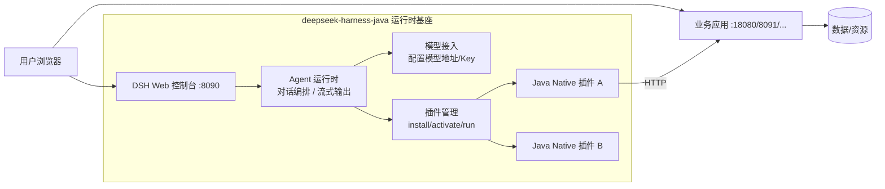

# DSH Java 架构说明（可生成架构图/导出给用户）

## 总体架构

## 分层职责

| 层 | 职责 |
| --- | --- |
| Web 控制台 | 模型设置、插件管理（上传/安装/启用）、Agent 对话（SSE 流式） |
| Agent 运行时 | 会话编排、工具分发（`plugin__<pluginId>__<tool>` 命名空间）、Hook 生命周期 |
| 插件体系 | Java Native Plugin：SPI 加载（`JavaHarnessPlugin`），`plugin.yaml` 描述，`tools()` 注册工具，`configure()` 注册系统提示词与 Hook |
| 业务应用 | Spring Boot 应用，持有真实数据与鉴权，暴露 REST API 供插件调用 |

## 关键机制

- **插件加载**：宿主扫描 `META-INF/services/cn.xiaofuge.deepseek.harness.domain.spi.JavaHarnessPlugin` SPI 文件实例化插件；`plugin.yaml` 提供元数据
- **工具暴露**：Agent 看到的工具名为 `plugin__<pluginId>__<toolName>`，系统提示词由插件 `configure()` 注册（带优先级）
- **Hook**：`PRE_TOOL_USE` / `POST_TOOL_USE` 可注入审计上下文，实现调用审计、风险拦截
- **安全模型**：插件不直接持有敏感资源凭据，通过业务应用 Admin API（HTTP）访问；应用侧做鉴权（service-token）与二次校验（如只读 SQL 强制校验）

## 两个案例的接入模式

1. **客服型**（2d-weekend-mall）：应用页面 AI 入口 → 代理 DSH `/api/agent/stream` → Agent 调插件工具 → 工具回源应用 API（service-token 鉴权）
2. **运维型**（dsh-java-mysql）：DSH 对话直接驱动只读运维工具 → 插件调 Admin API → Admin API 访问被管理资源；写操作永远走人工页面
